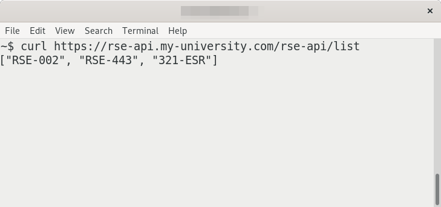

# Laptop

You having figured out the passcode (who uses such a short password anyway?) you tap it in and the RSE's desktop fades into view. Wherever they are now, they were clearly in the middle of something when they left: there are several applications open, but the only one you really recognise is their web browser so you focus on that.


The browser has a number of tabs open. You decide not to pry into their email, not yet at least, and it looks like they were planning a holiday in the Lake District. The remaining three tabs seem to go together so you decide to take a look what they were working on in case there are any hints as to where they are.

## Actions:

<details><summary>Look at browser tab 1</summary>
<a href="https://github.com/lostRSEs/wherearemycolleagues">lostRSEs/wherearemycolleagues: A simple Web API to track your colleagues! Use with caution.</a>
</details>

<details><summary>Look at browser tab 2</summary>
This seems to be a simple notes document. All it says is
```
?I ma erehW
```
</details>

<a href="https://cheatography.com/kstep/cheat-sheets/http-status-codes/">Look at browser tab 3</a>

<details><summary>Look at Terminal</summary>
You see there is a Terminal window open with the command:

 

You think you can probably edit this URL to try and find out more info about where the RSEs are...
</details>

## Execute list query
<script>
function listQ()
{
  var a=document.getElementById("list-span");
  document.getElementById('list-span').innerHTML= 'HTTP 200, ["RSE-002", "RSE-443", "321-ESR"]';
}
</script>

curl https://rse-api.my-university.com/rse-api/list
<br/>
<input type="button" value="click" onclick="listQ()">

<span id="list-span"></span>

## Execute location query

<script>
function locationCheck()
{
  var a=document.getElementById("location-text");
  if((a.value.toLowerCase()=="rse-002"))
  {
    document.getElementById('location').innerHTML= 'HTTP 200, At home';
  }
  else if((a.value.toLowerCase()=="rse-443"))
  {
    document.getElementById('location').innerHTML= 'HTTP 200, In maths department';
  }
  else if((a.value.toLowerCase()=="321-esr"))
  {
    document.getElementById('location').innerHTML= 'HTTP 200, At conference: CONF-003';
  }
  else
  {
    document.getElementById('location').innerHTML= 'HTTP 404, not found';
  }
}
</script>

curl https://rse-api.my-university.com/rse-api/location/<input type="text" id="location-text" name="name"/>
<input type="button" value="click" onclick="locationCheck()">
<br/>

<span id="location"></span>

## Execute conference query

<script>
function conferenceCheck()
{
  var a=document.getElementById("conference-text");
  if((a.value.toLowerCase()=="conf-003"))
  {
    document.getElementById('conference').innerHTML= 'HTTP 200, At Collaborations workshop 2021 (CW21)';
  }
  else
  {
    document.getElementById('conference').innerHTML= 'HTTP 404, not found';
  }
}
</script>

curl https://rse-api.my-university.com/rse-api/conference/<input type="text" id="conference-text" name="name"/>
<input type="button" value="click" onclick="conferenceCheck()">
<br/>

<span id="conference"></span>


## I ma erehW?

<input type="text" id="puzzle-1" name="name"/>
<input type="button" value="click" onclick="check()">
<br/>

<span id="err"></span>

<script>
function check()
{
  var a=document.getElementById("puzzle-1");
  if((a.value.toLowerCase()=="cw21")|| (a.value.toLowerCase()=="collaborations workshop 2021"))
  {
    document.getElementById('err').innerHTML= '<p>Correct! Congratulations, now go <a href="https://www.software.ac.uk/cw21">here</a> to learn more!</p>';
  }
  else
  {
    document.getElementById('err').innerHTML= 'Incorrect';
  }
}
</script>

